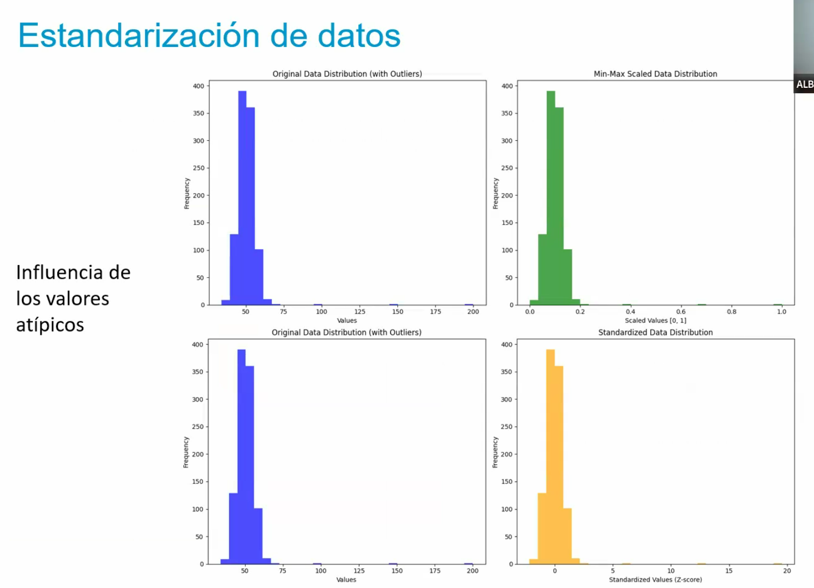
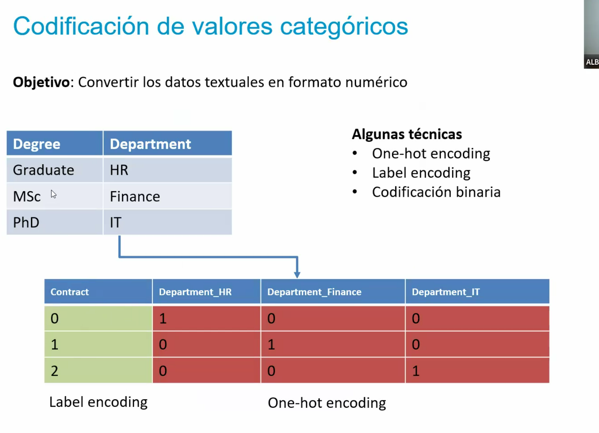
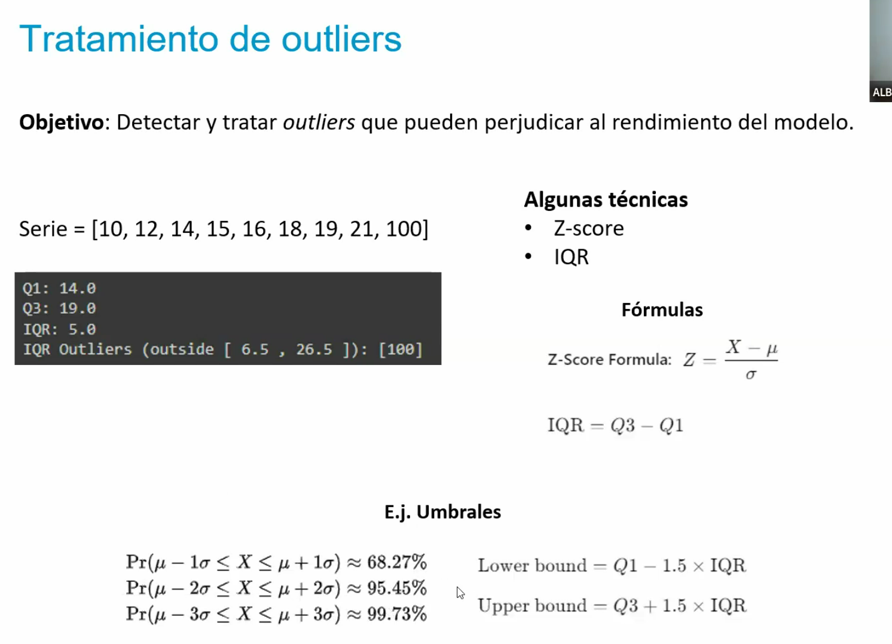

# Tema 1 - Introducción al aprendizaje automático no supervisado

## **1. Introducción y objetivos**
El *aprendizaje automático no supervisado* es una rama del *Machine Learning* que permite analizar datos sin etiquetas predefinidas. A diferencia del aprendizaje supervisado, en el que un modelo aprende a partir de ejemplos con respuestas correctas, el aprendizaje no supervisado identifica patrones ocultos y estructuras en los datos sin necesidad de etiquetas.

### **Objetivos del tema**
- Introducir los conceptos básicos del aprendizaje no supervisado.
- Comprender cómo los algoritmos pueden agrupar datos similares sin supervisión.
- Explorar técnicas como *K-Means, clustering jerárquico, DBSCAN* y métodos de reducción de dimensionalidad (*PCA, t-SNE*).
- Examinar la detección de anomalías y su aplicación en distintas áreas.
- Introducir el aprendizaje por refuerzo a través del algoritmo *Q-learning*.

## **2. Descripción general**
El aprendizaje no supervisado se fundamenta en la exploración de datos sin estructura predefinida. Su función es similar a la de un explorador que clasifica elementos desconocidos basándose en sus características.

Algunos ejemplos de aplicación incluyen:
- **Segmentación de clientes**: Empresas utilizan clustering para dividir a sus clientes en grupos según comportamiento de compra.
- **Bioinformática**: Identificación de patrones en secuencias genéticas.
- **Procesamiento de lenguaje natural (PLN)**: Algoritmos como *Latent Dirichlet Allocation (LDA)* identifican temas latentes en textos.
- **Astronomía**: Clasificación de galaxias y estrellas en base a sus propiedades físicas.
- **Detección de fraudes**: Identificación de transacciones sospechosas en bancos y sistemas financieros.

## **3. Términos clave**
Algunos conceptos esenciales en el aprendizaje no supervisado incluyen:
- **Clúster**: Grupo de datos con características similares.
- **Dimensionalidad**: Número de variables de un conjunto de datos.
- **Métrica de distancia**: Forma de medir la similitud entre puntos (ejemplo: *distancia euclidiana, Manhattan, coseno*).
- **Overfitting** (*sobreajuste*) : Cuando un modelo funciona bien con datos de entrenamiento, pero no generaliza correctamente.
- **Hiperparámetros**: Parámetros que se configuran antes de entrenar el modelo.

## **4. Retos del aprendizaje no supervisado**
Al no contar con etiquetas, los algoritmos enfrentan varios desafíos:
- **Número óptimo de clusters**: Técnicas como *elbow method* y *análisis de silueta* ayudan a determinar cuántos grupos se deben formar.
- **Maldición de la dimensionalidad**: En conjuntos de datos con muchas variables, se vuelve difícil encontrar patrones útiles.
- **Escalabilidad**: Los algoritmos deben manejar grandes volúmenes de datos sin perder precisión.
- **Ruido y outliers**: Datos anómalos pueden afectar los resultados de los modelos.
- **Interpretabilidad**: Sin etiquetas, la interpretación de los resultados depende de la experiencia del analista.

## **5. Flujo de trabajo en el aprendizaje no supervisado**
El proceso de desarrollo de modelos no supervisados sigue los siguientes pasos:
1. **Recolección de datos**: Obtención de información relevante desde diversas fuentes.
2. **Limpieza y preprocesamiento**: Eliminación de valores faltantes, normalización de datos y tratamiento de outliers.
3. **Selección de características**: Reducción de dimensionalidad para mejorar la eficiencia.
4. **Aplicación de algoritmos**: Uso de técnicas como *K-Means*, *DBSCAN*, *clustering jerárquico*, entre otras.
5. **Interpretación y evaluación de resultados**: Comparación de métricas como el índice de la silueta.

> Nota
> Si se normaliza antes del split estoy introduciendo data-leakes. Es mejor normalizar después.
> Conjunto de datos de test totalmente inalterados.
> Si yo tengo datos de test distintos a los datos de entrenamiento ahí está el reto. Hay que retar al modelo
> para que llegue a producción lo más robusto posible.

## RESUMEN DETALLADO – TEMA 3: DIFERENTES IMPLEMENTACIONES DE K-MEANS

## **6. Importancia del preprocesamiento**
Un buen preprocesamiento de datos mejora significativamente los resultados del aprendizaje no supervisado. Algunas tareas clave incluyen:
- **Manejo de valores faltantes**: Imputación o eliminación de registros con datos ausentes.
- **Escalado de características**: Normalización y estandarización para evitar que variables con valores más altos dominen el modelo.
- **Transformaciones de datos**: Aplicación de transformaciones como *logaritmo* o *Box-Cox* para mejorar la distribución de los datos.
- **Codificación de datos categóricos**: Conversión de variables de texto en valores numéricos.



> [!NOTE]
> No es es lo mismo un outlier (dato ruidoso) que una anomalía. Un outlier es un dato que tiene un valor muy extraño y que no tiene sentido. Una anomalía es un caso funcional.
> En el caso de la normalización hay un poco de aplastamiento aun que las distribuciones se mantienen. Son transformaciones lineales.

## **7. Técnicas de transformación de datos**
Para mejorar la calidad de los datos, se aplican diferentes transformaciones:
- **Transformación logarítmica**: Ayuda a reducir la asimetría y estabilizar la varianza.
- **Box-Cox**: Similar a la transformación logarítmica, pero con un parámetro *λ* para optimizar la normalización.
- **PowerTransformer** en *Scikit-Learn*: Técnica avanzada para mejorar la normalidad de los datos.

> [!NOTE]
> Reducción de dimensionalidad
>
> Preprocesamiento de imagenes (VA)
>
> Preprocesamiento de texto (PLN)

## **8. Técnicas de discretización**
La discretización convierte variables continuas en discretas, dividiendo los datos en intervalos o "bins".
Ejemplo en *Python* con *DecisionTreeClassifier* para discretizar datos sin supervisión:

```python
from sklearn.tree import DecisionTreeClassifier
import numpy as np
import pandas as pd

data = pd.read_csv("datos.csv")
numeric_cols = data.select_dtypes(include=['float64', 'int64']).columns

dt = DecisionTreeClassifier(max_leaf_nodes=4)
dt.fit(data[numeric_cols], np.zeros(len(data)))  # Matriz de ceros para adaptar la técnica
discretized_values = dt.apply(data[numeric_cols])
```

Otra técnica común es el uso de cuantiles para dividir datos en partes iguales.

## **9. Técnicas de codificación de datos categóricos**
Para convertir variables categóricas en datos numéricos, existen varios métodos:
- **One-Hot Encoding**: Crea una columna por cada categoría, asignando valores binarios (0 o 1).
- **Codificación ordinal**: Asigna valores numéricos a categorías según su orden.
- **Codificación binaria**: Convierte las categorías en valores binarios.
- **Codificación target**: Usa la media de la variable objetivo dentro de cada categoría.



Aquí tienes ejemplos concretos de cada método para convertir variables categóricas en numéricas:

### 1. **One-Hot Encoding**
```python
import pandas as pd

# Datos de ejemplo
data = {'Color': ['Rojo', 'Azul', 'Verde', 'Azul']}
df = pd.DataFrame(data)

# Aplicar One-Hot Encoding
df_encoded = pd.get_dummies(df, columns=['Color'])
print(df_encoded)
```
Salida:
```
   Color_Azul  Color_Rojo  Color_Verde
0           0           1            0
1           1           0            0
2           0           0            1
3           1           0            0
```

### 2. **Codificación Ordinal**
```python
from sklearn.preprocessing import OrdinalEncoder

# Datos con orden intrínseco (ej: tamaño)
data = {'Tamaño': ['Pequeño', 'Mediano', 'Grande', 'Mediano']}
df = pd.DataFrame(data)

# Definir orden y codificar
encoder = OrdinalEncoder(categories=[['Pequeño', 'Mediano', 'Grande']])
df['Tamaño_encoded'] = encoder.fit_transform(df[['Tamaño']])
print(df)
```
Salida:
```
    Tamaño  Tamaño_encoded
0  Pequeño             0.0
1  Mediano             1.0
2   Grande             2.0
3  Mediano             1.0
```

### 3. **Codificación Binaria**
```python
import category_encoders as ce

# Datos de ejemplo
data = {'Categoría': ['A', 'B', 'C', 'A']}
df = pd.DataFrame(data)

# Aplicar Binary Encoding
encoder = ce.BinaryEncoder(cols=['Categoría'])
df_encoded = encoder.fit_transform(df)
print(df_encoded)
```
Salida:
```
   Categoría_0  Categoría_1  Categoría_2
0            0            0            1  # A → 001 (solo se muestran los bits necesarios)
1            0            1            0  # B → 010
2            0            1            1  # C → 011 
3            0            0            1  
```

### 4. **Codificación Target (Mean Encoding)**
```python
# Datos con variable objetivo (para problemas supervisados)
data = {
    'Ciudad': ['NY', 'SF', 'NY', 'LA'],
    'Ventas': [100, 200, 150, 50] 
}
df = pd.DataFrame(data)

# Calcular media por categoría y reemplazar
mean_encoding = df.groupby('Ciudad')['Ventas'].mean().to_dict()
df['Ciudad_encoded'] = df['Ciudad'].map(mean_encoding)
print(df)
```
Salida:
```
  Ciudad Ventas Ciudad_encoded  
|------|-------|---------------|
| NY   |    100|          125.0| (Media de NY: (100+150)/2)  
| SF   |    200|          200.0|
| NY   |    150|          125.0|
| LA   |     50|           50.|
```

#### Nota importante: 
- Para **One-Hot**, usa `pd.get_dummies()` o `OneHotEncoder` de scikit-learn.
- La **codificación target** puede causar *overfitting*; considera usar técnicas como *smoothing* en datos pequeños.
- La librería `category-encoders` incluye implementaciones avanzadas de estos métodos y otros adicionales como *Hashing* o *Leave-One-Out*.

## **10. Ejercicios prácticos**
El documento incluye ejercicios aplicados al dataset de precios de viviendas de *Kaggle*, como:
1. **Exploración de datos** con *Pandas* y visualización de correlaciones con *Seaborn*.
2. **Aplicación de flujo de trabajo** en aprendizaje no supervisado.
3. **Preprocesamiento de datos**, eliminación de outliers y normalización.
4. **Discretización y codificación de datos categóricos**.

Ejemplo de eliminación de outliers usando el método *IQR*:
```python
Q1 = data['price'].quantile(0.25)
Q3 = data['price'].quantile(0.75)
IQR = Q3 - Q1
lower_bound = Q1 - 1.5 * IQR
upper_bound = Q3 + 1.5 * IQR
data_cleaned = data[(data['price'] >= lower_bound) & (data['price'] <= upper_bound)]
```



## **11. Referencias bibliográficas**
- Zhang, P. (2022). *Unsupervised Learning Algorithms in Big Data*.
- García-Gutiérrez, M. A. (2023). *Study of Dimensionality Reduction Techniques*.
- BitBoss (2023). *Aprendizaje supervisado, no supervisado y por refuerzo* [Vídeo en YouTube].

## **Conclusión**
El aprendizaje no supervisado es una herramienta poderosa para el análisis de datos sin etiquetas. A través de técnicas como *clustering, reducción de dimensionalidad y detección de anomalías*, es posible extraer conocimientos valiosos en múltiples áreas. Sin embargo, su éxito depende de un adecuado preprocesamiento y una correcta interpretación de los resultados.